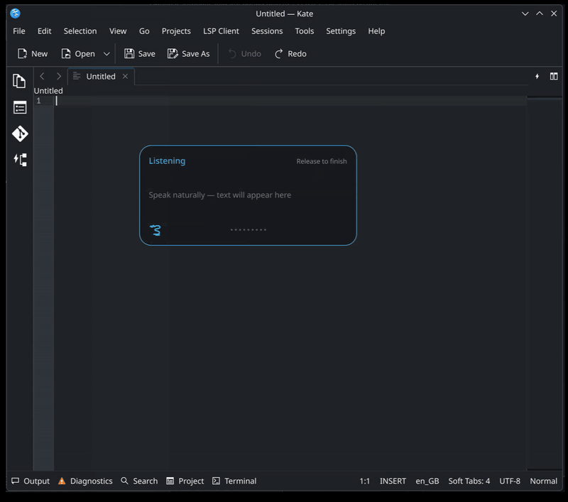
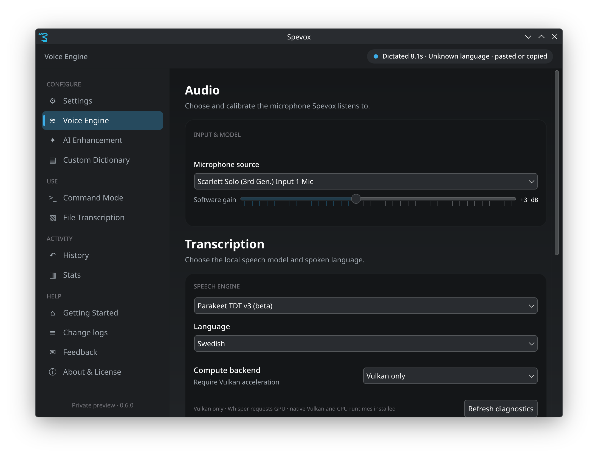
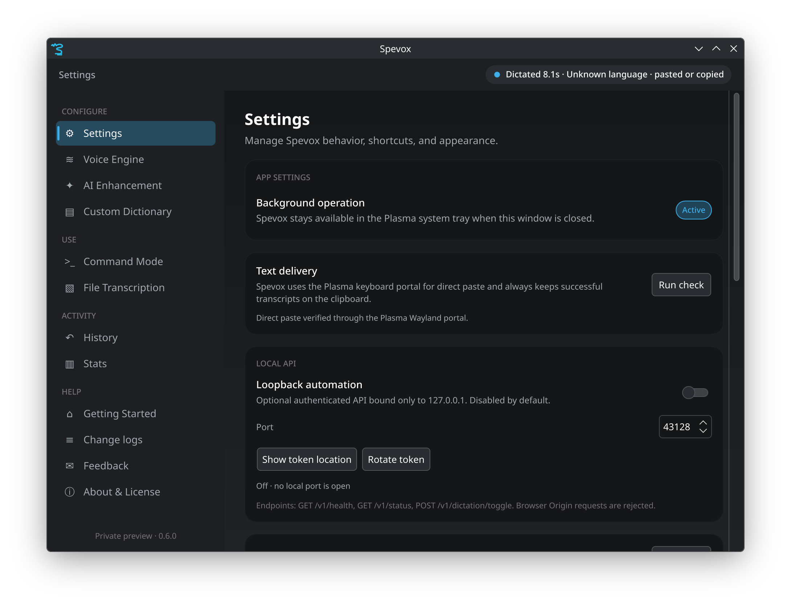
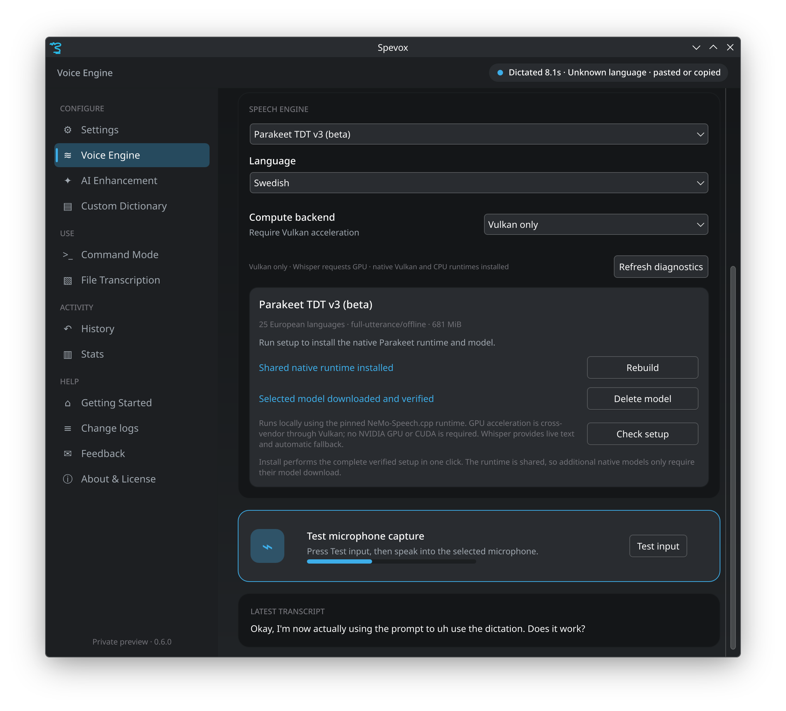
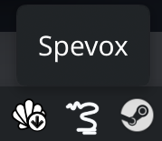

<p align="center">
  
</p>

<p align="center">
  <b>Local, private dictation for KDE Plasma on Wayland.</b><br>
  Hold a key, speak, release. The text appears in the application you are using.
</p>

<p align="center">
  <br>
  <sub><a href="docs/screenshots/demo.webm">Video version</a></sub>
</p>

<p align="center">
  Wayland and Plasma native&nbsp;&nbsp;·&nbsp;&nbsp;Speech recognition runs on your computer&nbsp;&nbsp;·&nbsp;&nbsp;Vulkan GPU acceleration with CPU fallback
</p>

> [!IMPORTANT]
> Spevox brings the ideas behind
> [FluidVoice for macOS](https://github.com/altic-dev/FluidVoice) to Linux. It
> is an independent project by David Bolin and is still under development.

Spevox records from PipeWire, transcribes speech locally with Whisper or NVIDIA
speech models, and pastes the result into the app you are using. Text cleanup is
optional and can run locally (Ollama, LM Studio); a cloud provider is used only
if you explicitly choose one.

## How it works

1. Place the cursor in any text field.
2. Hold `Ctrl+Alt+D` (the shortcut can be changed).
3. Speak.
4. Release the keys. The transcript is inserted, and always kept on the clipboard.

## Screenshots

| Voice engine | Settings | Native engines |
| --- | --- | --- |
| [](docs/screenshots/voice-engine.png) | [](docs/screenshots/settings.png) | [](docs/screenshots/native-engine.png) |
| Microphone, model, and language | Delivery, tray, and local API | Managed NVIDIA models and diagnostics |

Spevox lives in the Plasma system tray while running:



## Requirements

KDE Plasma 6 on Wayland, PipeWire, and x86_64. Vulkan is optional. Tested on
Arch Linux; other distributions build from source (see below).

## Current features

- Hold-to-dictate from any application through a Plasma-managed global shortcut.
- Selectable PipeWire microphone with software gain, live dBFS meter, and input test.
- Local multilingual Whisper transcription across all 99 supported languages.
- Experimental support for local OpenAI-compatible speech servers.
- Automatic language detection or a fixed language for more reliable short dictation.
- Tiny, Base, Small, Medium, Large Turbo, and Large v3 model management.
- Vulkan acceleration on compatible NVIDIA, AMD, and Intel GPUs with CPU fallback.
- Live transcript overlay with three sizes, adjustable placement and opacity,
  and optional result actions after dictation.
- Direct paste on Wayland where supported, with clipboard fallback.
- Native Plasma system tray, single-instance activation, and correct desktop identity.
- Persistent custom spellings and optional spoken formatting commands.
- Local MP3, FLAC, Ogg/Opus, M4A/AAC, WebM, MP4, and WAV transcription through
  FFmpeg, with timestamped segments and TXT, Markdown, SRT, WebVTT, or JSON
  export. Optional Sortformer diarization labels up to four speakers.
- Write Mode (`Ctrl+Alt+W`) rewrites selected text or drafts new text from a
  spoken instruction, with preview, retry, undo, and clipboard recovery.
- Command Mode runs a fixed set of desktop actions — open System Settings,
  Konsole, or Dolphin, or lock the screen. It never runs arbitrary commands.
- Transcript history with search, raw/final diffs, copy and undo, optional
  retained audio, and JSON, CSV, or ZIP export.
- KDE system theme/accent defaults plus explicit Spevox dark, light, and accent options.
- Optional AI cleanup through Ollama, LM Studio, supported cloud services, or a
  custom OpenAI-compatible endpoint. The original transcript is used if cleanup fails.
- Language-aware punctuation, formatting, and light grammar cleanup.
- Saved AI profiles for different apps and tasks.
- Local statistics for activity, streaks, time saved, and AI changes.
- Optional local microphone-audio history with a storage budget, automatic
  pruning, playback, individual deletion, and ZIP export.
- Optional local API for automation and dictation control.
- First-run setup for privacy, microphone choice, model selection, GPU use, and
  a test dictation. You can reopen it from Getting Started.

See [CHANGELOG.md](CHANGELOG.md) for release-by-release details.

## Quick start

### 1. Install build dependencies

The application currently requires:

- Rust 1.91 or newer with Cargo and rustfmt.
- Qt 6 Core, GUI, QML, Quick, Quick Controls 2, Network, Widgets, and `qmake6`.
- PipeWire development libraries.
- Vulkan loader, shader compiler, and development headers.
- `secret-tool` (from libsecret) when storing API keys for cloud AI providers.
- FFmpeg for broad audio-file transcription (16-bit PCM WAV retains a built-in fallback).

Install the build packages for your distribution, then install Rust 1.91 or
newer through [rustup](https://rustup.rs/) if your distribution ships an older
toolchain.

**Arch Linux / CachyOS**

```bash
sudo pacman -S --needed base-devel clang cmake ffmpeg git libpipewire libsecret \
  ninja qt6-base qt6-declarative qt6-tools shaderc vulkan-headers vulkan-icd-loader
```

**Fedora**

```bash
sudo dnf install gcc-c++ clang cmake git ninja-build pkgconf-pkg-config \
  qt6-qtbase-devel qt6-qtdeclarative-devel qt6-qttools-devel pipewire-devel \
  vulkan-headers vulkan-loader-devel glslc libsecret ffmpeg-free
```

**Ubuntu / Debian**

```bash
sudo apt update
sudo apt install build-essential clang cmake git ninja-build pkg-config \
  qt6-base-dev qt6-declarative-dev qt6-tools-dev qt6-tools-dev-tools \
  libpipewire-0.3-dev libvulkan-dev glslc libsecret-tools ffmpeg
```

Package names can vary between distribution releases. These commands cover the
main build and runtime requirements on current releases.

### 2. Build and install

Run the installer as your normal user. It builds with your Rust toolchain and
uses `sudo` only when copying files into `/usr/local`.

```bash
git clone https://github.com/davidkodar/spevox.git
cd spevox
./packaging/install.sh
spevox
```

For a development run without installation:

```bash
QMAKE=/usr/bin/qmake6 cargo run -p spevox-ui
```

Release tags publish a checksummed binary archive and an Arch `PKGBUILD`.
Automated release runs also publish Sigstore keyless signatures/certificates.
Verify a signed
download with `cosign verify-blob --certificate-identity-regexp
'github.com/davidkodar/spevox' --certificate-oidc-issuer
'https://token.actions.githubusercontent.com' --certificate FILE.pem
--signature FILE.sig FILE`. The manifest under `packaging/flatpak` is a
developer preview and is not published as a release artifact: host KWin
integration, keyring access, native-runtime setup, and desktop actions still
need portal-native implementations before the sandboxed package is supported.

Packages are distributed through GitHub Releases rather than the AUR. The
prebuilt x86_64 archive targets Arch-family systems. Fedora, Ubuntu, Debian, and
other distributions should build from source for now. To install a release
archive:

```bash
tar xzf spevox-<version>-x86_64.tar.gz
cd spevox-<version>
./packaging/install.sh
```

The archive installer checks its required libraries before installing anything.

On Arch Linux you can instead build a native package from the `PKGBUILD` that
accompanies each release. It builds from the checksummed source archive:

```bash
curl -LO https://github.com/davidkodar/spevox/releases/download/v<version>/PKGBUILD
makepkg -si
```

Spevox is not in the AUR yet.

### 3. Configure dictation

1. Open **Voice Engine** and select the correct microphone.
2. Press **Test input** and confirm the meter follows your voice.
3. Download and activate a Whisper model. Base is a practical starting point
   for English; other languages may benefit from a larger model. Accuracy,
   memory use, and latency vary by language and hardware.
4. Select a fixed language for reliable short dictation, or use Automatic for
   mixed-language speech.
5. Leave compute on **Automatic (Vulkan)** for GPU acceleration with safe CPU
   fallback.
6. Hold the configured shortcut (initially `Ctrl+Alt+D`), speak, and release it
   to transcribe and paste.

Plasma may ask you to approve or choose the shortcut the first time. Closing
the settings window leaves Spevox running in the system tray.

## Alternatives

[Speech Note](https://github.com/mkiol/dsnote) is the broader offline speech
application for Linux: it also does text-to-speech and machine translation,
supports more engines and desktops, and is on Flathub. Spevox does one thing —
hold-to-dictate on Plasma Wayland, with optional local or cloud text cleanup.

## Models, languages, and storage

One multilingual Whisper model works for every exposed language. Managed model
downloads come from the official
[`ggml-org/whisper.cpp`](https://github.com/ggml-org/whisper.cpp) artifacts.

### Language support by engine

The language list in Settings always offers Whisper's full range. When a native
engine cannot handle the language you fixed, Spevox transcribes with your
selected Whisper model instead and says so in the status line.

| Engine | Languages |
| --- | --- |
| Whisper (all sizes) | 99 |
| Parakeet TDT v3 | 25 European: `bg` `cs` `da` `de` `el` `en` `es` `et` `fi` `fr` `hr` `hu` `it` `lt` `lv` `mt` `nl` `pl` `pt` `ro` `ru` `sk` `sl` `sv` `uk` |
| Nemotron 3.5 Multilingual | 38: `ar` `bg` `ca` `cs` `da` `de` `el` `en` `es` `et` `fa` `fi` `fr` `he` `hi` `hr` `hu` `id` `it` `ja` `ko` `lt` `lv` `ms` `nl` `no` `pl` `pt` `ro` `ru` `sk` `sl` `sv` `th` `tr` `uk` `vi` `zh` |
| Nemotron Streaming English | English |
| Parakeet CTC 1.1B | English |

Parakeet TDT v3 detects the language itself, so a fixed language is a hint
rather than a constraint; short phrases are occasionally recognised as another
language it knows. Whisper honours a fixed language directly, which makes it
the more reliable choice for short dictation in a specific language.

Built-in Whisper is the supported default. **Local speech server
(experimental)** accepts an OpenAI-compatible `/v1/audio/transcriptions`
service at HTTP loopback only. Spevox encodes the captured mono signal as
PCM WAV and will reject remote hosts, HTTPS URLs, recordings longer than two
minutes, or responses above 1 MiB. Live preview is unavailable because the
external process receives audio only after recording stops. This lets you
update the speech server separately from Spevox. The app does not currently
bundle [sherpa-onnx](https://github.com/k2-fsa/sherpa-onnx).

**Native NVIDIA speech engines (beta)** — Parakeet TDT v3, Nemotron 3.5
Multilingual, Nemotron Streaming English, and Parakeet CTC 1.1B — are managed by
Spevox without Python, PyTorch, or CUDA. One click builds or reuses a pinned
NeMo-Speech.cpp runtime and downloads the chosen official quantized model,
verifying its size and SHA-256 digest before activation. Building the runtime
from source needs Git, CMake 3.26+, Ninja, and a C++17 compiler.

"NVIDIA" names the runtime and model publisher, not a hardware requirement. GPU
acceleration uses cross-vendor Vulkan on supported AMD, Intel, and NVIDIA
drivers and keeps a CPU fallback; automatic compute installs the CPU runtime
when the Vulkan development packages are incomplete.

The helper listens only on `127.0.0.1` and is supervised by Spevox. Any failure
during setup, startup, or transcription is reported, and the recording is
transcribed with your selected Whisper model rather than lost.

Live partial text currently runs on CPU only, because the pinned runtime's
Vulkan streaming path can crash on Nemotron audio; Vulkan still handles the
final transcription. Parakeet TDT v3 is full-utterance-only, so it shows the
periodic Whisper preview instead.

**Speaker diarization (experimental)** is an optional file-transcription mode,
not part of the normal dictation hot path. One-click setup reuses the pinned
NeMo-Speech.cpp runtime and downloads a revision-pinned, SHA-256-verified GGUF
conversion of NVIDIA's Sortformer 4-speaker v2 checkpoint. It runs locally on
CPU or cross-vendor Vulkan, assigns each timestamped Whisper segment to the
speaker with the greatest time overlap, and carries those labels into History
and every meeting export format. If the model, runtime, or inference fails,
Spevox retains the complete Whisper transcript without speaker labels.
The consumable GGUF is generated by the documented Spevox release process
rather than published by NVIDIA and is labelled accordingly in the app.
Sortformer supports at most four
speakers and was trained primarily on English; noisy, overlapping, non-English,
or very long conversations may be less accurate.

Maintainers can reproduce the downloadable Q8 artifact with
`packaging/build-sortformer-model.sh`. The script pins both the NVIDIA
checkpoint and NeMo-Speech.cpp converter revisions, uses a temporary CPU-only
Python environment, verifies the source and output SHA-256 values, and leaves
only `target/package/sortformer-v2-q8_0.gguf`. Python and PyTorch are build-time
conversion tools only; neither is installed or invoked by Spevox.

User data follows XDG conventions:

- Models: `$XDG_DATA_HOME/spevox/models` or `~/.local/share/spevox/models`.
- Dictionary: `$XDG_DATA_HOME/spevox/dictionary.txt`.
- History: `$XDG_DATA_HOME/spevox/history.tsv` (legacy entries are migrated
  compatibly as new enriched entries are appended).
- Settings: `$XDG_CONFIG_HOME/spevox/settings.conf` or `~/.config/spevox/settings.conf`
  (created on the first settings change).
- Application profiles: `$XDG_DATA_HOME/spevox/ai-profiles.json`.
- Command history: `$XDG_DATA_HOME/spevox/command-history.tsv`.
- Local API token: `$XDG_CONFIG_HOME/spevox/local-api.token` (mode `0600`).

When upgrading from a 0.5.x private preview, Spevox continues using the legacy
`fluidvoice` XDG directory if no corresponding `spevox` directory exists. This
keeps settings, downloaded models, history, dictionaries, retained audio, API
tokens, and provider secrets available without copying or deleting user data.
New installations use the `spevox` paths above.

Audio is processed locally and is saved only when Audio History is turned on.
Saved recordings use
`$XDG_DATA_HOME/spevox/audio-history`, are capped by the selected budget,
and are removed when History is cleared. History and dictionary data can be
cleared from the interface or removed from the paths above.

AI enhancement is off by default. Ollama and LM Studio keep cleanup on your
computer, and Spevox can list the models installed in either one. The Ollama
page can tell whether Ollama is missing, stopped, or has no models. It can start
`ollama serve` and download a model, but installing Ollama itself is left to you.

Local presets accept only addresses on this computer. Cloud services stay
locked until you turn off the local-only setting. A cloud service receives the
transcript and cleanup instructions, never the microphone recording. API keys
are stored with the desktop Secret Service, not in `settings.conf`. If cleanup
fails, Spevox uses the original transcript.

Automatic application profiles are also disabled by default. The installer
ships `spevoxprofiles`, a small KWin script, but it is enabled only when the
user turns on **Automatic KWin profile selection**. KWin then reports the active
application class and window title to Spevox's session-local D-Bus endpoint.
Profile rules use comma-separated, case-insensitive fragments; blank rules stay
manual-only. Disabling the option disables the KWin script again.

## Local automation API

The local API is disabled by default. Enable it under **Settings → Local API**,
choose a non-privileged port, and restart Spevox. It binds exclusively to
IPv4 loopback (`127.0.0.1`), rejects browser `Origin` requests, limits request
headers, applies short I/O timeouts, and never accepts filesystem paths or shell
commands. Copy or rotate its 256-bit bearer token from the same settings card.

```bash
TOKEN="$(cat "${XDG_CONFIG_HOME:-$HOME/.config}/spevox/local-api.token")"
curl http://127.0.0.1:43128/v1/health
curl -H "Authorization: Bearer $TOKEN" http://127.0.0.1:43128/v1/status
curl -X POST -H "Authorization: Bearer $TOKEN" \
  http://127.0.0.1:43128/v1/dictation/toggle
```

Only health is unauthenticated. Status and dictation control require the token;
rotating it immediately revokes existing clients.

## GPU acceleration

**Automatic (Vulkan)** is the default compute mode. whisper.cpp uses a compatible
GPU when one is available and falls back to CPU otherwise. **CPU** disables GPU
initialization explicitly. **Vulkan only** requires GPU acceleration instead of
falling back.

Successful GPU initialization includes output similar to:

```text
ggml_vulkan: 0 = NVIDIA GeForce RTX 4080
whisper_backend_init_gpu: using Vulkan0 backend
```

If Spevox reports `no GPU found`, verify the system independently:

```bash
nvidia-smi              # NVIDIA only
vulkaninfo --summary
```

## Development and diagnostics

See [CONTRIBUTING.md](CONTRIBUTING.md) for the branch model, change workflow,
release process, and security expectations.

Run the test suite and formatting checks with:

```bash
cargo fmt --all --check
cargo test --workspace
```

Useful diagnostics include:

```bash
cargo run -p spevox-cli -- --diagnose-shortcut
cargo run -p spevox-cli -- --diagnose-text-delivery
cargo run -p spevox-cli -- --diagnose-audio 3 [PIPEWIRE_NODE]
cargo run -p spevox-cli -- --diagnose-transcription /path/to/model.bin 5 [PIPEWIRE_NODE]
cargo run -p spevox-cli -- --diagnose-workflow /path/to/model.bin 5 [PIPEWIRE_NODE]
```

The Voice Engine page also reports the selected CPU/Vulkan policy and provides
a refreshable compute diagnostic. This describes the requested runtime policy;
the transcription log remains the authoritative record of the backend actually
initialized by the model runtime.

Before cutting a release candidate, run `packaging/release-check.sh` for the
automated formatting, QML, test, release-build, staged-install, and package
checks.

The application ID is `io.github.davidkodar.Spevox`. The matching
desktop entry, icon, AppStream metadata, and GPL license are installed by
`packaging/install.sh`. Use `packaging/install-dev.sh` when iterating on a debug
build, or `packaging/uninstall.sh` to remove application files without deleting
models, settings, history, or other user data.

Releases are built by a manually dispatched GitHub Actions workflow from a
tagged commit as versioned `x86_64.tar.gz` archives with SHA-256 checksum files. `packaging/package-tarball.sh` reproduces
that artifact locally. The in-app update check reads public GitHub Releases;
releases are never installed silently.

Embedded whisper.cpp is the default and automatic fallback.
The four managed NVIDIA engines are optional native KDE/Linux backends. Apple
Speech is an Apple platform service, while the currently published Cohere and
Parakeet Flash integrations rely on CoreML/Apple Neural Engine; they are shown
as platform gaps rather than nonfunctional Linux download buttons. Parakeet v2
is likewise omitted because NVIDIA does not publish a ready, verifiable GGUF
artifact for the pinned native runtime.

## Architecture

- Rust provides capture, transcription, persistence, portals, model downloads,
  delivery, and state management.
- Qt Quick/QML provides the Plasma interface and compact recording overlay.
- CXX-Qt exposes typed Rust controller state to QML.
- PipeWire captures audio and converts it to mono 16 kHz floating-point samples.
- whisper.cpp performs local inference through Vulkan or CPU backends.
- XDG desktop portals provide the global shortcut and consented Wayland input path.

More detail is available in [docs/ARCHITECTURE.md](docs/ARCHITECTURE.md).

## Project status and roadmap

Spevox already covers everyday dictation, audio-file transcription, local
history, optional AI cleanup, app profiles, and release packages. It is still
under development. Better model setup, accessibility, native distribution
packages, and wider hardware testing are still on the list.

### Completed in 0.6.0

- **Spevox name and icon:** renamed the app and updated its executable, desktop
  entry, package name, and application ID. Existing 0.5.x settings, models, and
  history continue to work.

- **Code cleanup and security:** split up large parts of the controller, moved
  slow startup work away from the interface, removed duplicated code, and
  expanded the release checks.

- **Better AI cleanup:** improved punctuation, capitalization, questions,
  fillers, false starts, spoken formatting, and numbers. Prompts follow the
  selected language, and tests cover English, Swedish, and other languages.
  This works with supported local and cloud services; it is not Fluid-1.

Please use [GitHub Issues](https://github.com/davidkodar/spevox/issues)
for reproducible bugs and focused feature proposals.

## Upstream relationship and licensing

Spevox is an independent Linux app inspired by the GPLv3-licensed
[FluidVoice](https://github.com/altic-dev/FluidVoice) project for macOS. Spevox
is made and maintained by David Bolin. See [LICENSE](LICENSE),
[CREDITS.md](CREDITS.md), and [THIRD_PARTY_NOTICES.md](THIRD_PARTY_NOTICES.md)
for license and attribution details. The generated
[THIRD_PARTY_LICENSES.html](THIRD_PARTY_LICENSES.html) bundles the license texts
and crate attribution for the locked Rust dependency graph.

Fluid Intelligence is a separate, privately maintained component and is not
part of this repository.
